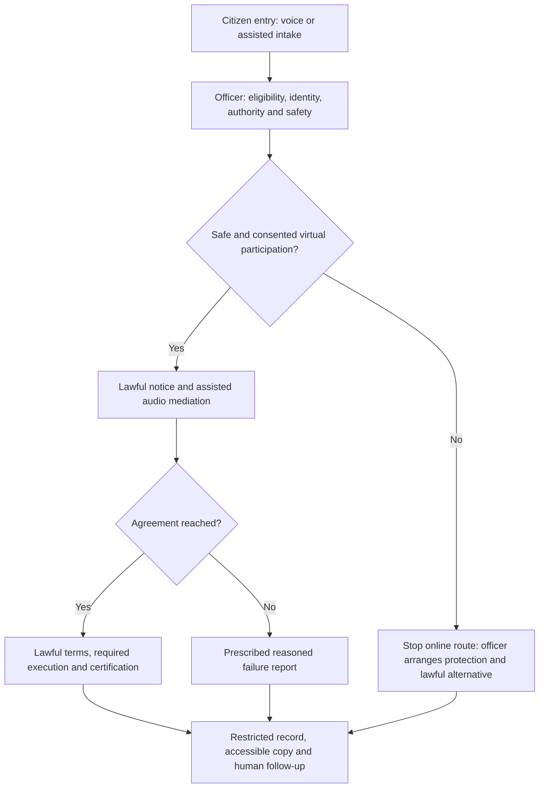

# Process diagram for challenge 4

## Diagram explanation

The officer controls the safety gate before online mediation. An unsafe channel leads to protection and a lawful alternative. A safe session produces either a properly executed, certified agreement or a failure report. Each route retains a protected record and a named follow-up officer.

Stopping the online route does not itself waive mandatory initiation or create a valid failure report. The officer applies the relevant procedure. The diagram is a simplified view of the [answer](answer.md).
