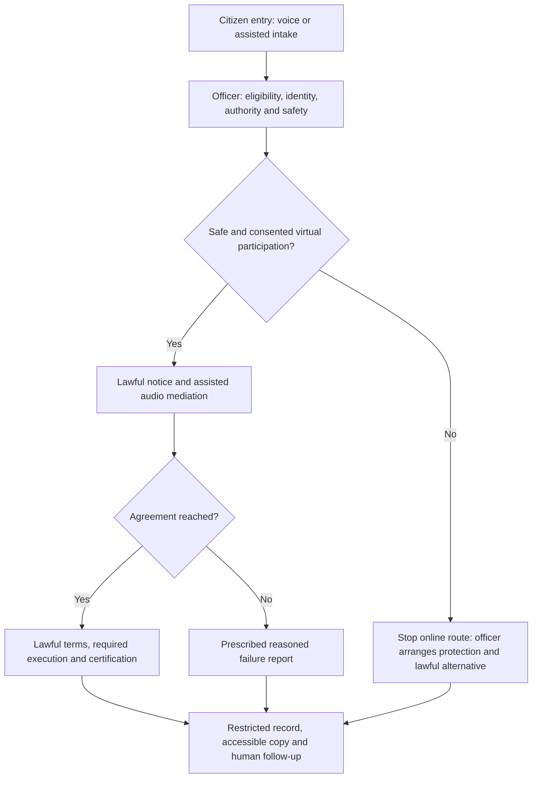

# Round-1 answers

Research reviewed on 5 September 2026. These answers address the supplied Moyuri and Ripon scenario. Sources appear beside the claims they support. Proposed features are identified as proposals.

Word counts below count the visible answer text, including citation labels, and exclude this introduction, headings and link destinations. Challenge 4 has a separate diagram and explanation under its stated allowance.

## 1. Citizen access

186 words; limit 200.

The change is explicit recognition of direct and online applications. Section 16(1) of the Legal Aid Services Act, 2000, substituted by section 24 of the 2026 Amendment Act, permits applications to the Directorate's Supreme Court legal aid office or regional, district, and upazila legal aid offices. DBLA publishes the [consolidated Act](https://objectstorage.ap-dcc-gazipur-1.oraclecloud15.com/n/axvjbnqprylg/b/V2Ministry/o/office-nlaso/2026/4/1c316c8c-ff1a-4cfa-863b-106072b00b0e.pdf); the [amendment gazette](https://www.dpp.gov.bd/upload_file/gazettes/61406_96331.pdf) confirms the replacement.

Operationally, an office can receive an application remotely, record its arrival, and assign it for human review. DBLA's existing [online form](https://db.nlaso.gov.bd/Pages/OnlineApplications.aspx) could support that process, alongside assisted entry for people who cannot complete it themselves.

We propose Bangla voice-assisted intake that turns Ripon's account into a structured draft, reads it back for correction, and routes it to Joypurhat's legal aid office. It would distinguish the applicant from her representative, label his account as unverified third-party information, and flag missing documents for human follow-up.

An officer would verify Moyuri's instructions safely and decide eligibility. Direct filing would remain available. The system would never send an automatic acknowledgement to her handset. This makes the online option usable without treating internet access, document possession, or a relative's call as proof of consent.

[Research notes](../questions/01-citizen-access/research.md) · [Source register](../questions/01-citizen-access/sources.md)

## 2. AI for legal aid

281 words; limit 300.

DBLA's [service charter](https://objectstorage.ap-dcc-gazipur-1.oraclecloud15.com/n/axvjbnqprylg/b/V2Ministry/o/office-nlaso/2026/6/bcfb1eb6-07c3-4a05-a4fe-63f2353914aa.pdf) provides for 16699 advice; [section 7(1)(গ) of the Act](https://objectstorage.ap-dcc-gazipur-1.oraclecloud15.com/n/axvjbnqprylg/b/V2Ministry/o/office-nlaso/2026/4/1c316c8c-ff1a-4cfa-863b-106072b00b0e.pdf) provides for emergency legal support. We propose this AI-assisted workflow:

1. The assistant identifies itself as AI in Bangla, offers a person, checks whether Ripon can speak safely, and asks about immediate danger. It explains its limited intake role and how the information will be used.

2. AI can explain available services, ask approved questions, transcribe his account and read it back for correction. It records "Ripon's report; Moyuri not consulted" beside every allegation. Approximate dates and unknown answers are acceptable. Information already in the file remains attributed to its original source.

3. Reported violence and deprivation require prompt human review. Flag child risks or further abuse as disclosed; Moyuri's instructions remain unverified. Assault in progress, serious injury, threats to kill, strangulation, weapons, child danger or imminent discovery of the call trigger urgent transfer before routine intake finishes. Uncertain current safety is flagged, not treated as reassurance.

4. A named officer accepts the handover, assesses safety and lawful next steps, and arranges safe verification with Moyuri. If transfer fails, the system alerts backup staff under an approved emergency protocol and tells Ripon what remains pending. It never silently closes the enquiry.

The handover includes Ripon's relationship and access needs; allegations, dates and provenance; known risks, including any reported child risk; missing identity information; transcription uncertainties; contact restrictions; consent and proxy authority still unverified; and the escalation reason and owner.

AI must not decide credibility, eligibility, legal strategy, mediation suitability or consent. It must not contact Sohel or automatically notify Moyuri's handset. Ripon's permission covers his own interaction, not Moyuri's instructions. No household callback occurs without a safely verified arrangement.

[Research notes](../questions/02-ai-for-legal-aid/research.md) · [Source register](../questions/02-ai-for-legal-aid/sources.md)

## 3. Justice operations

289 words; limit 300.

DBLA's [amended Act](https://objectstorage.ap-dcc-gazipur-1.oraclecloud15.com/n/axvjbnqprylg/b/V2Ministry/o/office-nlaso/2026/4/1c316c8c-ff1a-4cfa-863b-106072b00b0e.pdf), section 7, supports emergency assistance and digital access. We propose a published decision table using exactly three factors:

1. Risk from delay. The DLAO considers present danger, worsening violence, serious injury, child safety and urgent deprivation. Record each indicator as yes, no or unknown, with its time, source and a short explanation. Serious reported danger flags immediate human review even before verification is complete.

2. Time-sensitive legal need and arguable relief. The officer considers deadlines, hearings and remedies that may need prompt action. Display dates with their sources, the issue requiring advice, and a human-reviewed preliminary assessment. Use "assessment pending" where facts are missing; never substitute an AI win probability for legal merit.

3. Barriers to obtaining help. Record poverty, dependency, disability-related access needs, restricted movement and unsafe communication as concrete barriers. For Moyuri, these include monitored phones and inaccessible documents; Ripon's blindness requires spoken assistance. Raise priority where these barriers make delay more harmful.

The screen shows the three assessments separately, their reasons and uncertainty. It groups files into suggested priority bands; the DLAO confirms or changes the band and records why. Comparable cases retain first-contact order, with daily review of waiting files and new risks. Ageing files trigger supervisory review without becoming another merit score.

Incomplete information never becomes zero risk or an automatic downgrade. An assisted-review route preserves the original contact date and helps complete the file safely. Urgency and evidence confidence remain separate.

Give authorised recipients an accessible explanation and a way to request priority reconsideration. Audit waiting times and overrides across channels and access barriers. This internal review differs from the statutory appeal against rejection of aid under section 16(2). No algorithm rejects an application or determines its final legal merits.

[Research notes](../questions/03-justice-operations/research.md) · [Source register](../questions/03-justice-operations/sources.md)

## 4. ODR and accountability

318 words; limit 350.

DBLA's [Paikgacha ODR pilot permission](https://objectstorage.ap-dcc-gazipur-1.oraclecloud15.com/n/axvjbnqprylg/b/V2Ministry/o/office-nlaso/2026/3/5f5666b4-99d8-4e4b-9137-8b09970cd3a9.pdf) requires legal compliance, human coordination and confidentiality. Our proposed process follows the [2025 mediation rules](https://objectstorage.ap-dcc-gazipur-1.oraclecloud15.com/n/axvjbnqprylg/b/V2Ministry/o/office-nlaso/2024/12/5038ecb1d58c4ecaba546d5db0c62254.pdf).

Citizen entry: Ripon calls 16699 or uses assisted intake. Staff create a reference and source-labelled draft, recording his role, missing documents and prohibited contact channels. His report is not Moyuri's consent.

Eligibility/intake: An officer privately verifies Moyuri's wishes, identity and any proxy authority, checks eligibility, urgency and jurisdiction, and separates maintenance, dowry demands and injury allegations. Joypurhat's applicable commencement notices govern mandatory initiation. A dowry demand is not a debt to negotiate; any criminal compromise needs the lawful process. Staff resolve missing documents through accepted procedures.

Stop if Moyuri cannot participate privately and without coercion. Block online progression and notify the responsible officer for protection, a safe alternative and any applicable initiation/report requirements. Record an unsafe virtual channel, not an automatic refusal of mediation or rejection of aid. Rule 19(1) requires consent to virtual meetings.

Mediation: After safety screening and required consents, the officer assigns an authorised, conflict-free mediator and arranges lawful notices. Use short audio sessions, with separate discussions where needed, at safely agreed times. Staff assist both locations. A dropped connection pauses the session; it never implies consent. Staff track procedural deadlines without automatic household reminders.

Outcome: Read lawful proposed terms aloud in Bangla, including payment amounts and dates. Under rule 13, obtain required party/authorised-representative and witness signatures, the mediator's signature and seal, required photographs, and Chief Legal Aid Officer certification. Use staff-supported physical execution if a valid domestic digital method is unconfirmed. Spoken agreement alone is insufficient. If mediation fails, issue the prescribed reasoned report.

Record/follow-up: Keep controlled copies, service proof, consent, attendance, certification and access logs under applicable retention rules. Give accessible copies through an authorised safe route. Assign an officer to check performance and handle enforcement or court referral; section 21C governs properly certified settlements. Private contact windows stay outside shared mediation records.

[Research notes](../questions/04-odr-and-accountability/research.md) · [Source register](../questions/04-odr-and-accountability/sources.md)

### Process diagram

### Diagram explanation

The officer controls the safety gate before online mediation. An unsafe channel leads to protection and a lawful alternative. A safe session produces either a properly executed, certified agreement or a failure report. Each route retains a protected record and a named follow-up officer.

Stopping the online route does not itself waive mandatory initiation or create a valid failure report. The officer applies the relevant procedure. The diagram is a simplified view of the [answer](../questions/04-odr-and-accountability/answer.md).

## 5. Community innovation

225 words; limit 250.

Protect one item: the note recording when Moyuri can speak privately. In the wrong hands, it could expose her attempt to seek help.

Moyuri should be able to review it safely. Only these staff should have routine access: the assigned legal-aid officer, designated caseworker, and an assigned lawyer who needs to contact her. Ripon receives only the access she authorises; being her brother or supplying the phone number gives no blanket permission. Sohel, unrelated staff and other users must not see it. A mediator receives staff-arranged appointments without the private timing note.

Store the note separately. For each request, the server checks identity, role, active case assignment and any proxy permission. Apply those checks to exports and search results as well as screens. Encrypt the data, log access without copying the note, and revoke permissions when assignments or authorisation end. These controls follow the purpose and security principles in the [Personal Data Protection Act, 2026](https://objectstorage.ap-dcc-gazipur-1.oraclecloud15.com/n/axvjbnqprylg/b/V2Ministry/o/office-ictd/2026/3/1c355c6a-cc9c-42a0-b07f-e0876b89dc9d.pdf), sections 16-17.

Using DBLA's advertised [16699 service](https://dbla.gov.bd/pages/static-pages/69ca4e8234fc363bf320ca55), we propose a Bangla telephone step for Ripon to review or request an authorised update. After human verification, staff read it aloud, accept corrections and confirm whether the change is approved or pending Moyuri's safe confirmation. He needs no sighted helper, app or visual OTP. Caller ID and voice alone prove neither identity nor consent. The system sends nothing automatically to Moyuri's handset.

[Research notes](../questions/05-community-innovation/research.md) · [Source register](../questions/05-community-innovation/sources.md)

## 6. Call centre and omnichannel support

225 words; limit 250.

DBLA's current [online application](https://db.nlaso.gov.bd/Pages/OnlineApplications.aspx) asks for a typed "General Description (সাধারন বর্ণনা)". Ripon can explain events aloud, but cannot independently enter and check this text. An entrepreneur typing for him does not solve verification. The [district charter](https://objectstorage.ap-dcc-gazipur-1.oraclecloud15.com/n/axvjbnqprylg/b/V2Ministry/o/office-nlaso/2026/6/a84db22f-9b31-4abd-a32d-c01e51460d62.pdf), page 11, already provides office assistance with form completion.

We propose extending that assistance into one shared, voice-to-form draft through 16699. A trained operator asks short Bangla questions, enters the account, and reads each section back. Ripon corrects it orally. Optional AI transcription remains subject to that check and human review. The authorised Union Digital Centre operator can resume the same draft with restricted access.

Ripon uses an ordinary voice call, so he needs neither internet on his phone nor a readable screen. Staff speak a reference number and explain what remains outstanding. A reference locates the draft; it does not authenticate the caller.

The service preserves required information, documents, signatures and authorisation. Staff record Ripon separately as the reporter, leave unknown facts unresolved, and arrange safe verification of Moyuri's instructions. They distinguish an enquiry or draft from a formally accepted application.

A contact restriction blocks every automated SMS, OTP, callback and voicemail to Moyuri's handset. Ripon calls in for permitted updates after agreed verification; staff never assume the tea-stall number is safe for callbacks. The [central charter](https://objectstorage.ap-dcc-gazipur-1.oraclecloud15.com/n/axvjbnqprylg/b/V2Ministry/o/office-nlaso/2026/6/bcfb1eb6-07c3-4a05-a4fe-63f2353914aa.pdf) supports 16699 advice; integrated voice filing is our proposed extension.

[Research notes](../questions/06-call-centre-and-omnichannel/research.md) · [Source register](../questions/06-call-centre-and-omnichannel/sources.md)
